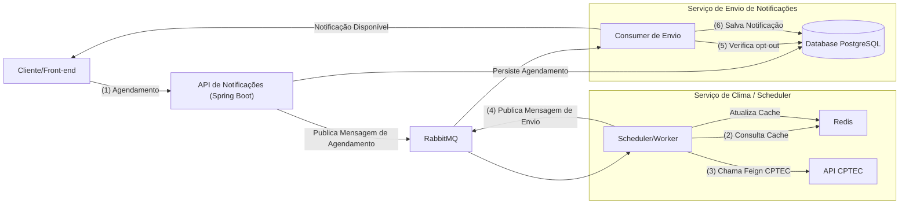

# Meli Challenge Weather Notifications

Bem-vindo ao repositório **meli-challenge-weather-notifications**!  
Este projeto foi desenvolvido como parte de um desafio técnico para enviar notificações sobre previsões climáticas obtidas a partir da API do [CPTEC/INPE](http://servicos.cptec.inpe.br/XML/).

---

## Sumário

1. [Visão Geral](#visão-geral)
2. [Arquitetura](#arquitetura)
3. [Fluxo Resumido](#fluxo-resumido)
4. [Serviços e Pastas](#serviços-e-pastas)
5. [Como Executar](#como-executar)
    - [Requisitos](#requisitos)
    - [Executando com Docker Compose](#executando-com-docker-compose)
    - [Acesso aos Serviços](#acesso-aos-serviços)
6. [Principais Endpoints](#principais-endpoints)
7. [Melhorias Futuras](#melhorias-futuras)
8. [Contribuindo](#contribuindo)
9. [Contato](#contato)

---

## Visão Geral

O objetivo é criar uma solução para **agendar e enviar notificações** sobre o clima para usuários. Os dados de previsão do tempo são obtidos da API **CPTEC/INPE**, com capacidade de:

- Obter **previsão climática** para os próximos 4 dias.
- Obter **previsão de ondas** para cidades litorâneas no dia atual.
- Agendar notificações em horários específicos.
- Evitar envio para usuários opt-out.
- Armazenar e consultar notificações enviadas.
- Possibilitar futuras extensões para outros canais (e-mail, SMS, push, etc.).

Para garantir a escalabilidade e robustez, foram utilizadas as seguintes tecnologias:
- **Spring Boot** (microserviços)
- **OpenFeign** (comunicação com a API externa)
- **RabbitMQ** (fila de mensageria)
- **Redis** (cache de previsões climáticas)
- **PostgreSQL** (persistência de dados)
- **Docker Compose** (para orquestração local)

---

## Arquitetura

A solução está organizada em **microserviços** independentes dentro de um único repositório. Cada microserviço tem seu próprio `Dockerfile` e pode ser escalado separadamente.



---

## Fluxo Resumido

1. **Criação do Agendamento**: O cliente faz uma requisição para a **API Notifications** para agendar uma notificação (cidade, data/hora).
2. **Persistência e Fila**: A **API** grava o agendamento no banco (**PostgreSQL**) e publica uma mensagem de agendamento no **RabbitMQ**.
3. **Scheduler (Worker)**:
    - Verifica quais agendamentos estão prontos para envio.
    - Obtém dados do CPTEC via **OpenFeign**, armazenando no **Redis**.
    - Publica mensagem de envio na fila (**RabbitMQ**).
4. **Envio de Notificações**: O **Notification Sender** consome a mensagem da fila e verifica se o usuário está opt-out. Se não estiver, registra a notificação enviada no banco de dados.
5. **Leitura de Notificações**: O cliente pode consultar as notificações enviadas por meio da **API Notifications**.

---

## Serviços e Pastas

Estrutura do repositório:

```
meli-challenge-weather-notifications
├── api-notifications
│   ├── pom.xml
│   ├── src/...
│   └── Dockerfile
├── schedule-worker
│   ├── pom.xml
│   ├── src/...
│   └── Dockerfile
├── notification-sender
│   ├── pom.xml
│   ├── src/...
│   └── Dockerfile
├── docker-compose.yml
├── README.md  <-- (este arquivo)
└── ...
```

---

## Como Executar

### Requisitos

- **Java 17+**
- **Docker** e **Docker Compose** instalados
- **Maven** (ou Gradle, caso escolha compilar localmente)

### Executando com Docker Compose

1. Clone o repositório:
   ```sh
   git clone https://github.com/suaorg/meli-challenge-weather-notifications.git
   ```
2. Na raiz do projeto, execute:
   ```sh
   docker-compose up --build
   ```
   Isso iniciará os seguintes serviços:
    - PostgreSQL (localhost:5432)
    - RabbitMQ (localhost:5672, console em localhost:15672)
    - Redis (localhost:6379)
    - API Notifications (localhost:8080)
    - Schedule Worker
    - Notification Sender

### Acesso aos Serviços

- **API Notifications** (http://localhost:8080)
    - `POST /notifications/schedule` (agendar notificação)
    - `POST /notifications/users/{id}/opt-out` (opt-out usuário)
    - `GET /notifications?userId={id}` (listar notificações enviadas)

- **RabbitMQ Management** (http://localhost:15672, usuário: guest, senha: guest)

---

## Melhorias Futuras

1. Suporte a novos canais (e-mail, SMS, push etc.).
2. Retry e tolerância a falhas (ex.: Spring Retry, circuit breaker).
3. Autenticação/Autorização (JWT, OAuth2).
4. Kubernetes para orquestração.
5. Observabilidade (logs centralizados, tracing, métricas).
6. API Gateway para unificação do acesso.

---

## Contribuindo

1. Faça um fork do projeto.
2. Crie uma branch com sua feature ou correção.
3. Abra um Pull Request descrevendo suas mudanças.

---

## Contato

- **Autor:** Bruno Laino de Andrade ([brunolaino.sd@gmail.com](mailto:brunolaino.sd@gmail.com))
- **LinkedIn:** [Bruno Laino de Andrade](https://www.linkedin.com/in/bruno-laino/)

Fique à vontade para enviar dúvidas ou sugestões!

Obrigado por conferir este projeto!

