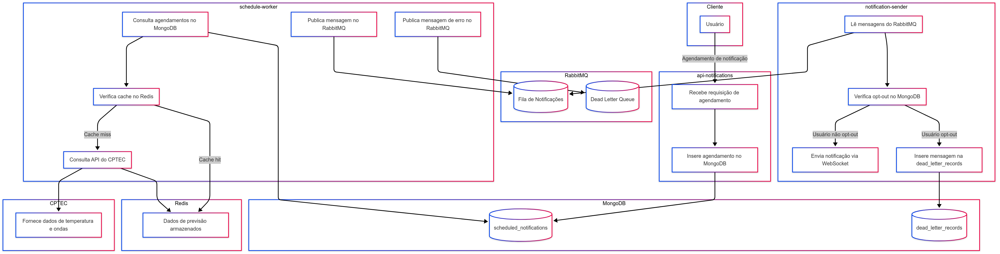

# Meli Challenge Weather Notifications

Bem-vindo ao repositório **meli-challenge-weather-notifications**!  
Este projeto foi desenvolvido como parte de um desafio técnico para enviar notificações sobre previsões climáticas obtidas a partir da API do [CPTEC/INPE](http://servicos.cptec.inpe.br/XML/).

---

## Sumário

1. [Visão Geral](#visão-geral)
2. [Arquitetura](#arquitetura)
3. [Fluxo Resumido](#fluxo-resumido)
4. [Serviços e Pastas](#serviços-e-pastas)
5. [Como Executar](#como-executar)
    - [Requisitos](#requisitos)
    - [Executando com Docker Compose](#executando-com-docker-compose)
    - [Acesso aos Serviços](#acesso-aos-serviços)
6. [Principais Endpoints](#principais-endpoints)
7. [Melhorias Futuras](#melhorias-futuras)
8. [Contribuindo](#contribuindo)
9. [Contato](#contato)

---

## Visão Geral

O objetivo é criar uma solução para **agendar e enviar notificações** sobre o clima para usuários. Os dados de previsão do tempo são obtidos da API **CPTEC/INPE**, com capacidade de:

- Obter **previsão climática** para os próximos 4 dias.
- Obter **previsão de ondas** para cidades litorâneas (**dia atual**).
- Agendar notificações em horários específicos.
- Evitar envio para usuários opt-out.
- Armazenar e consultar notificações enviadas.
- Possibilitar futuras extensões para outros canais (e-mail, SMS, push, etc.).

### Tecnologias Utilizadas

- **Spring Boot** (microserviços)
- **OpenFeign** (comunicação com API externa)
- **RabbitMQ** (fila de mensageria)
- **Redis** (cache de previsões climáticas)
- **MongoDB** (persistência de dados)
- **Docker Compose** (orquestração local)

---

## Arquitetura

A solução está organizada em **microserviços** independentes dentro de um único repositório. Cada microserviço tem seu próprio `Dockerfile` e pode ser escalado separadamente.



---

## Fluxo Resumido

1. **Criação do Agendamento**: O cliente faz `POST` para **api-notifications**, informando dados da cidade e do horário de envio.
2. **Persistência**: O microserviço **api-notifications** insere o registro em `scheduled_notifications` no **MongoDB**.
3. **Leitura de Agendamentos**: Periodicamente (a cada 1 minuto), o **schedule-worker** lê os registros em `scheduled_notifications` cujo horário venceu e prepara a notificação (obtendo dados do CPTEC se necessário).
4. **Publicação da Notificação**: O **schedule-worker** posta a mensagem de notificação (ou de erro) no **RabbitMQ**.
5. **Envio de Notificações**: O **notification-sender** consome a fila, verifica se o usuário está opt-out e, caso contrário, envia a notificação via **WebSocket**.
6. **Erros e Dead Letter Queue**: Em caso de falha, as mensagens problemáticas são enviadas à *Dead Letter Queue* e registradas na collection `dead_letter_records` no **MongoDB**.

---

## Principais Endpoints

1. **Agendar Notificação**
    - `POST /notifications/schedule`
    - **Body Exemplo**:
      ```json
      {
        "userId": 0,
        "when": "2025-02-17T12:53:55.187Z",
        "cityName": "string",
        "cityId": "string",
        "litoranea": true
      }
      ```
2. **Opt-out de Usuário**
    - `POST /notifications/users/{userId}/opt-out`

---

## Como Executar

### Requisitos

- **Java 17+**
- **Docker** e **Docker Compose** instalados
- **Maven** (ou Gradle, caso escolha compilar localmente)

### Executando com Docker Compose

1. Clone o repositório:
   ```sh
   git clone https://github.com/suaorg/meli-challenge-weather-notifications.git
   ```
2. Na raiz do projeto, execute:
   ```sh
   docker-compose up --build
   ```
   Isso iniciará os seguintes serviços:
    - MongoDB (localhost:27017)
    - RabbitMQ (localhost:5672, console em localhost:15672)
    - Redis (localhost:6379)
    - API Notifications (localhost:8080)
    - Schedule Worker
    - Notification Sender

### Acesso aos Serviços

- **API Notifications** (http://localhost:8080)
    - `POST /notifications/schedule` (agendar notificação)
    - `POST /notifications/users/{id}/opt-out` (opt-out usuário)
    - `GET /notifications?userId={id}` (listar notificações enviadas)

- **RabbitMQ Management** (http://localhost:15672, usuário: guest, senha: guest)
-
- **Swagger** (http://localhost:8080/swagger-ui/index.html#/)

---

## Melhorias Futuras

1. Suporte a novos canais (e-mail, SMS, push etc.).
2. Autenticação e Autorização.
3. Kubernetes para orquestração.
4. Observabilidade (logs centralizados, tracing, métricas).
5. API Gateway para unificação do acesso.

---

## Contato

- **Autor:** Bruno Laino de Andrade ([brunolaino.sd@gmail.com](mailto:brunolaino.sd@gmail.com))
- **LinkedIn:** [Bruno Laino de Andrade](https://www.linkedin.com/in/bruno-laino/)

Fique à vontade para enviar dúvidas ou sugestões!

Obrigado por conferir este projeto!
